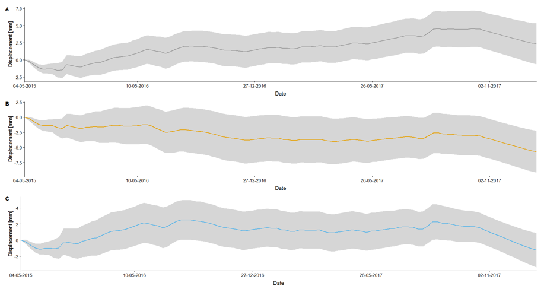
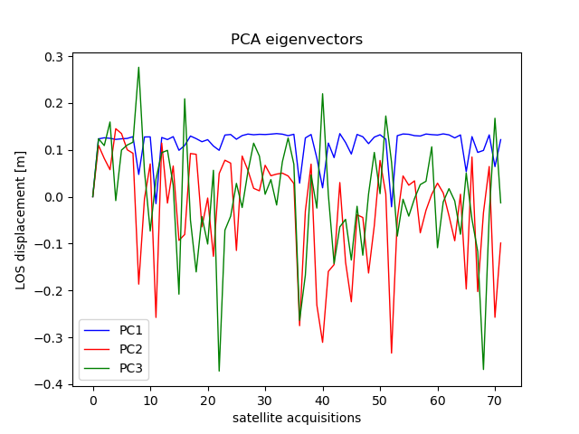
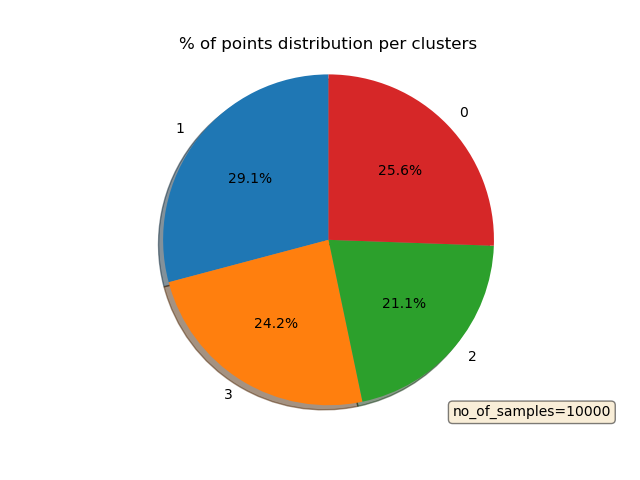
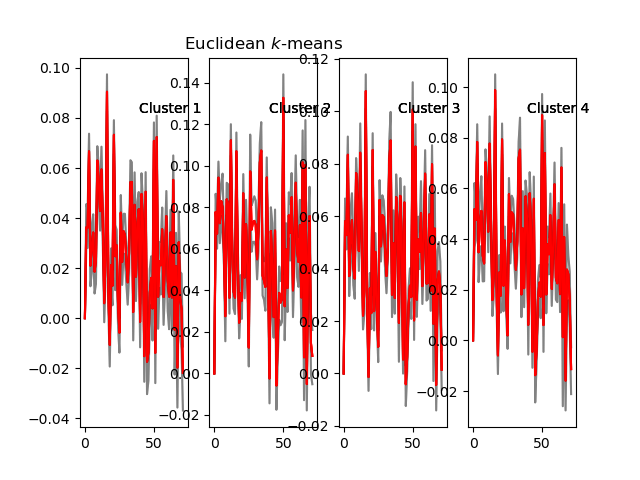

# InSAR_clustering
InSAR_clustering is an open-source code written in Python that support users in analysing time series of ground deformation.
I have developed this tool for improving the analysis of InSAR time series results. Grouping the data in few clusters allows an easier interpretation on the geological/geophysical source of ground deformation.
Usually InSAR results consist in matrix of millions of different targets (namely the radar target/pixel) by hundreds of different time intervals so the manual interpretation of this matrix is unfeasbile if not time consuming.

The underlying approach of the InSAR_clustering script is described in detail in the following British Geological Survey (BGS) Open Report:
Novellino, A.; Terrington, R.; Christodoulou, V.; Smith, H.; Bateson, L.. 2019 Ground motion and stratum thickness comparison in Tower Hamlets, London. Nottingham, UK, British Geological Survey, 31pp. (OR/19/043). http://nora.nerc.ac.uk/id/eprint/525619/ 

# Description
The python script can be divided in three main parts:
1) loading the data, which is (as usual!) the most time consuming part considering that datatsets produced with different software will inevitably have different format.
2) Performing a Principal Component Analysis (PCA) of the time series. More details on the application of PCA on InSAR time series are here: https://doi.org/10.3390/rs10040607
3) Performing a Cluster analysis where the number of clusters is based on the number of components retrieved in (2) with the PCA.

For (3) it is necessary to import the sklearn module. In particular, the 'TimeSeriesKMeans' clustering method has been used.

# 1.Installation
To run the script, first install scikit-learn (see https://scikit-learn.org/stable/install.html). All the relevant packages are uploaded at the beginning of the code (lines 12-27).

# 2.Input files
The test files used in the script are saved in the 'example' folder and described in Section 3.

# 3.Usage
Define the project directory (line 31)
Load the timeseries data. They must have the following structure: rows correspond to different measurment points/pixels while column correspond to different dates.
Our data are embedded in an array called 'df_array' (see the df_array.csv' file inside example). The dataset used represents displacements recorded at 72 different dates between 2016 and 2019 from Sentinel-1 satellite data over a small area including 10,000 pixels taken north of the Hanoi Province (Vietnam). 
Therefore the array has the following dimensions: 25,000 rows x 72 columns.
The array has been generated from the SBAS technique available in the Automatic InSAR Processor developed by the Earth Observation team in BGS. For more information on this, do please ask E.Hussain (ekhuss@bgs.ac.uk) or myself (alessn@bgs.ac.uk) for more details.  
Coordinates for this pixels are saved in the 'coords.csv' file inside example and are in the WGS84 system. First column is the latitude and the second is the longitude. They will be attached in the output file and used only at the end.
At this point the scripts can be divided in three parts: PCA analysis (section 3.1), cluster analysis (Section 3.2) and export of the outputs (Section 3.3)

   # 3.1 PCA
   This part is needed to understand how many components contribute to the variance of the timeseries. It is therefore a temporally organised PCA to find uncorrelated time courses where each pixel is a variable and each interferogram represent a dimension. The output will let us understand how many component contributes to 90% of the variance in the timeseries. This number will be used as input for defining the number of clusters in the cluster analysis (Section 3.2).
   
   
   
   
   # 3.2 Cluster Analysis
   This part is needed to understand how many components contribute to the variance of the timeseries. It is therefore a temporally organised PCA to find uncorrelated time courses where each pixel is a variable and each interferogram represent a dimension. The output will let us understand how many component contributes to 90% of the variance in the timeseries. This number will be used as input for defining the number of clusters in the cluster analysis (Section 3.2).
   
   
   
   
   For the 4 main clusters found in this example, we are able to display the median value (red line), the 10th (lower grey line) and 90th (upper grey line) percentile of the displacements timeseries of the pixels according to the cluster they belong to.
   
   
   
   # 3.3 Outputs
   Finally, two results are generated, see the 'outputs' (folder of this repository):
   - 'df_cluster_displ.csv' with the time series of the median value of the dispacement timeseries of each cluster.
   - 'df_coords_cluster.csv' with the lat/long coordinated and the cluster group which can be diplayed in any GIS program.
